# Getting started under 5 minutes

This guide is made with Synology NAS Docker GUI, but the steps here are generally applicable to any Docker GUI.

- [Getting started under 5 minutes](#getting-started-under-5-minutes)
    - [1. Add Image](#1-add-image)
    - [2. Create Container](#2-create-container)
    - [3. Advanced Settings](#3-advanced-settings)
    - [4. Advanced Settings - Volume](#4-advanced-settings---volume)
    - [5. Advanced Settings - Port](#5-advanced-settings---port)
    - [6. Advanced Settings - Environment](#6-advanced-settings---environment)
    - [7. Turn On Container](#7-turn-on-container)
    - [8. Check Container status in Terminal](#8-check-container-status-in-terminal)
    - [9. Shut down container](#9-shut-down-container)
  - [Generating new world](#generating-new-world)

* [Generating new world](#generating-new-world)

### 1. Add Image
- Run Docker and search for `ackvf/terraria`.
- There aren't any special versions so just download the default one.

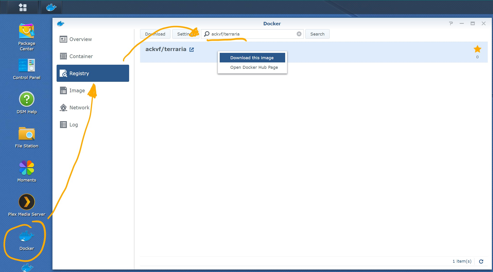

### 2. Create Container
- Go to <kbd>**Image**</kbd> and double click `ackvf/terraria`.
- Choose your container name.
- Open <kbd>**[Advanced Settings]**</kbd>.

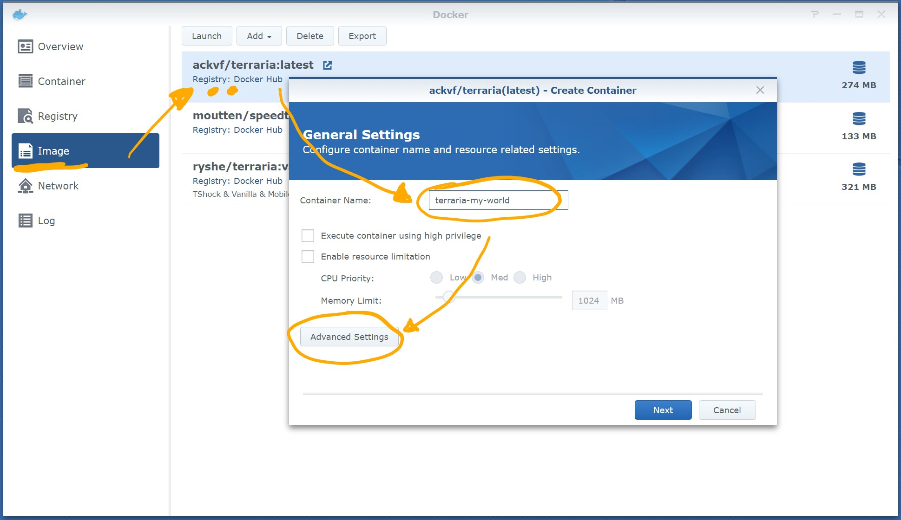

### 3. Advanced Settings
- check <kbd>Enable auto-restart</kbd>
- check <kbd>Create shortcut on desktop</kbd>

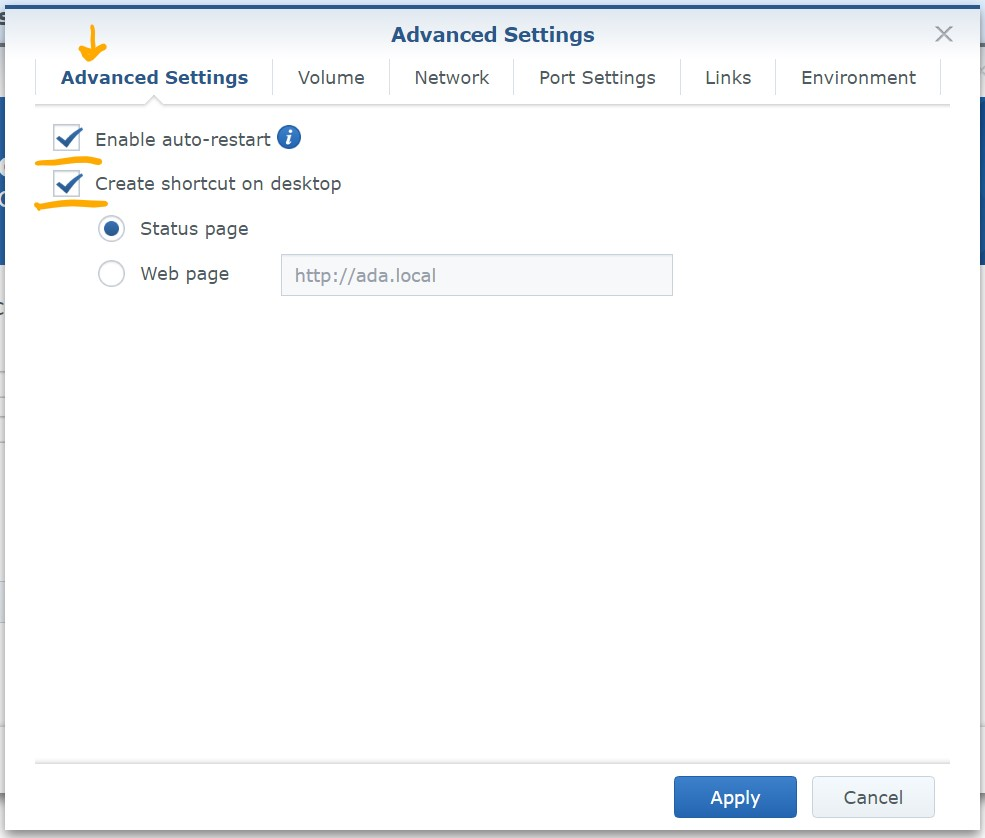

### 4. Advanced Settings - Volume

- Open <kbd>File Station</kbd> and create a folder for Terraria (1) under <kbd>**docker**</kbd>. **TIP: Add <kbd>terraria</kbd> to Favorites with the **star** in addressbar.*
- Create new folder for each world/server (2).  
  *note: You can configure the mount path and file names in container's env variables, so this is just recommended.*
- *Optional:* Copy over your server config files (3).  
  If you don't provide `serverconfig.txt` or `banlist.txt` they will get generated on first run of the server.  
    *note: restart server after updating server config files*
    
  * a) You have existing world  
    - Copy over (drag & drop) your map file and optionally server config files.  
    On Windows maps are found under `%userprofile%\Documents\My Games\Terraria\Worlds`  

  * b) You want to start with new world  
    - Continue with the guide up until step 7 and then see [Generating new world](#generating-new-world).

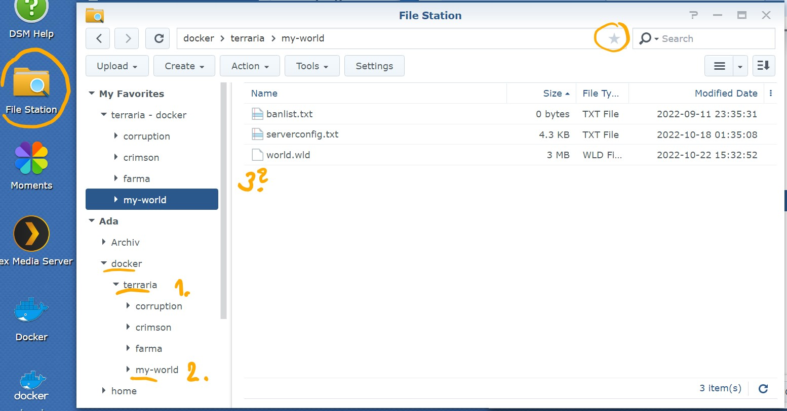

- Back in <kbd>Docker / Volume</kbd> Press <kbd>**[Add Folder]**</kbd> and pick the folder from the list.
- Adjust **Mount path** to `/terraria/config`

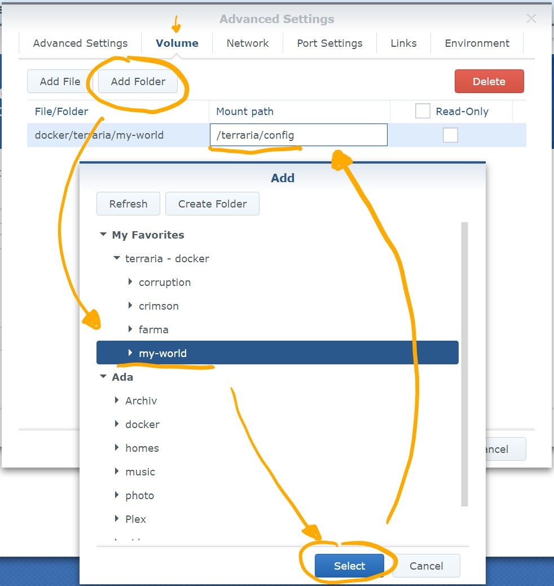

### 5. Advanced Settings - Port
- Choose your own external port (<kbd>Local Port</kbd>).  
  <kbd>Local Port</kbd> needs to be different for each server. Keep internal <kbd>Container Port</kbd> `7777`.

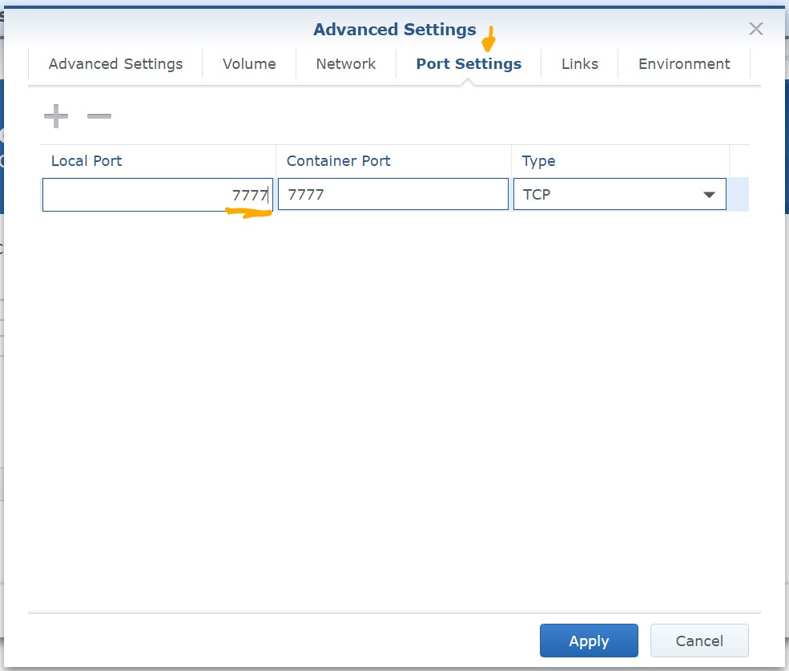

### 6. Advanced Settings - Environment
- Adjust `DOWNLOAD_VERSION` to current latest version e.g. `1446-fixed`.  
  *Find latest version on [terraria.org](https://terraria.org/) at the bottom "PC Dedicated Server". This corresponds to the downloaded file `terraria-server-1446-fixed.zip`.*
- *Optional:* `FILENAME_CONFIG`
- *Optional:* `FILENAME_WORLD` <- empty this variable if you want to create new world. (see [step 4a.](#4-advanced-settings---volume))
- *Optional:* `FILENAME_BANLIST`

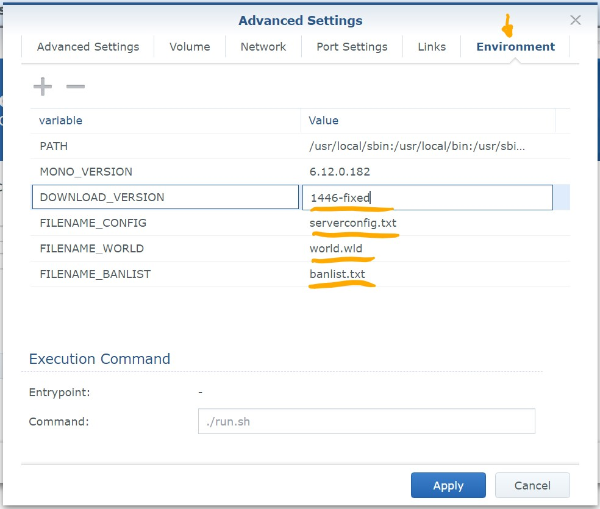

### 7. Turn On Container
- If you want to create new world, you need to do these changes first [Generating new world](#generating-new-world).
  
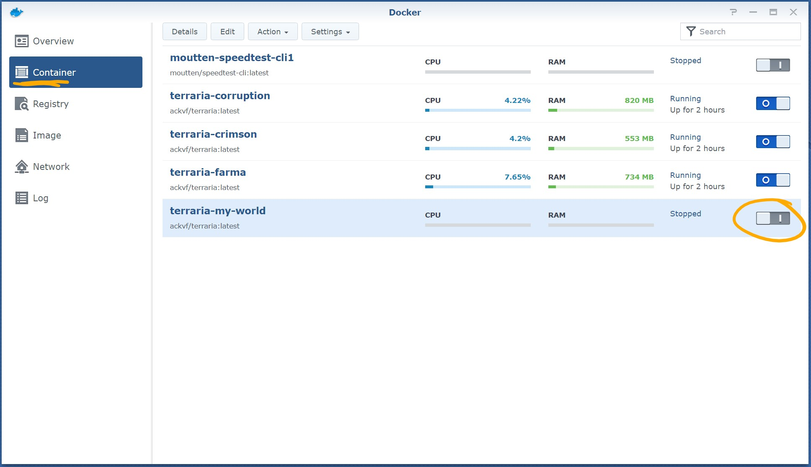

### 8. Check Container status in Terminal
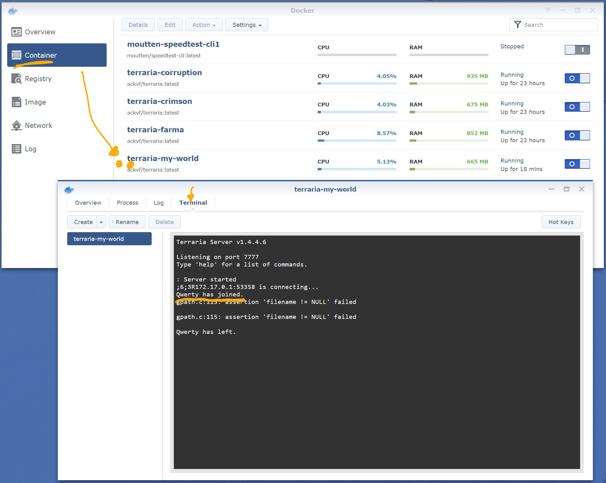

### 9. Shut down container
- Type `exit` in terminal.  
_**Don't** shut down container using the button as in [step 7](#7-turn-on-container) as this **won't save** the world. Although a backup is saved every 10 minutes._

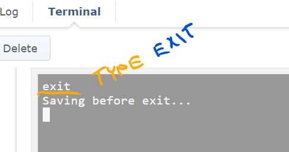

## Generating new world

Proceed with the guide up until [step 7](#7-turn-on-container) and before you start the container make these changes:

  1. in Environment variables (see [step 6](#6-advanced-settings---environment)) erase `FILENAME_WORLD`
  2. *Optional:* Copy over (drag & drop) your server config files.  
  If you don't provide `serverconfig.txt` or `banlist.txt` they will get generated on first run of the server.
  3. Start the container
     - and follow the interactive "Choose world" prompt.
     - or stop the server right after. Edit newly created `serverconfig.txt` and restart the container to load new config.  
     New map will get generated with provided configuration.
  4. After your world is generated adjust `FILENAME_WORLD=My_World.wld` in **Environment** to match the new filename and stop the server.
  5. Continue with the guide from [step 7](#7-turn-on-container).
  
  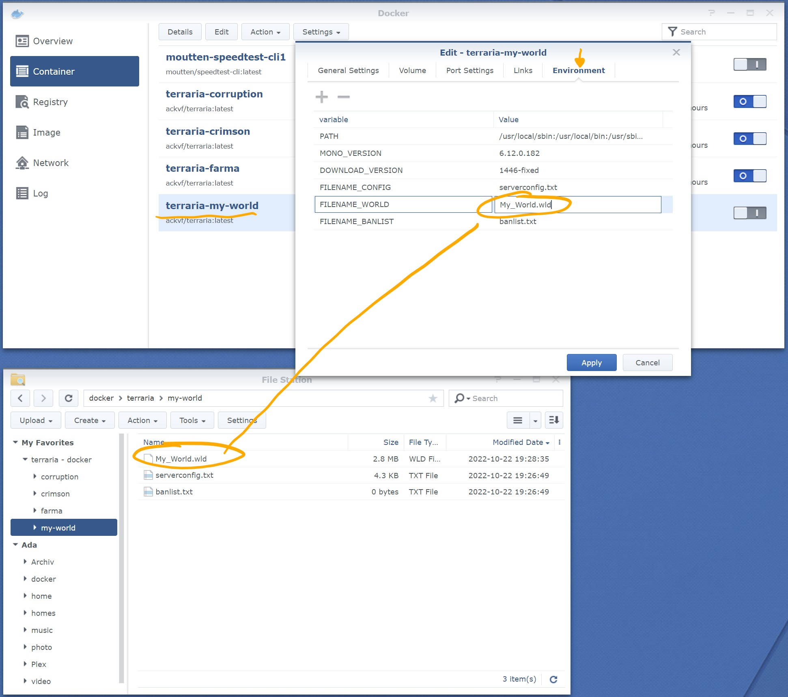
